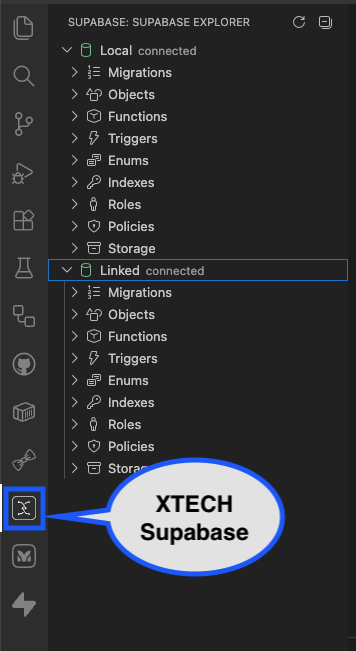
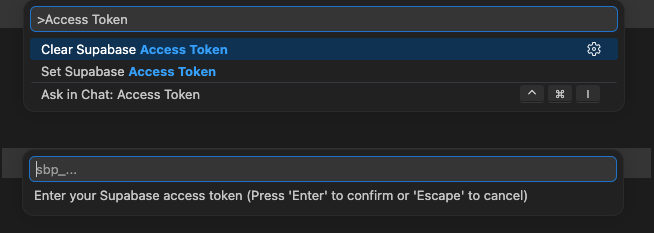
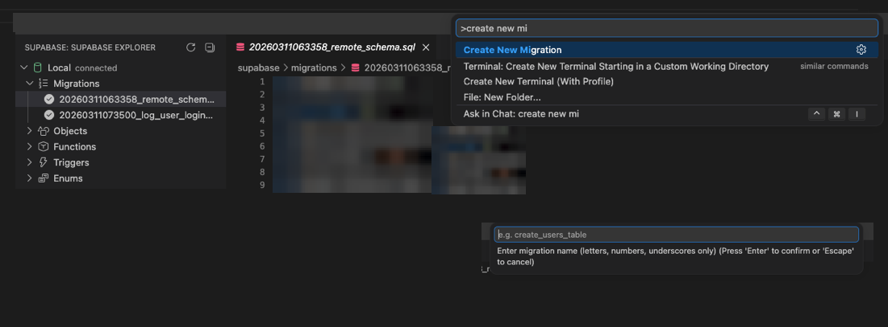
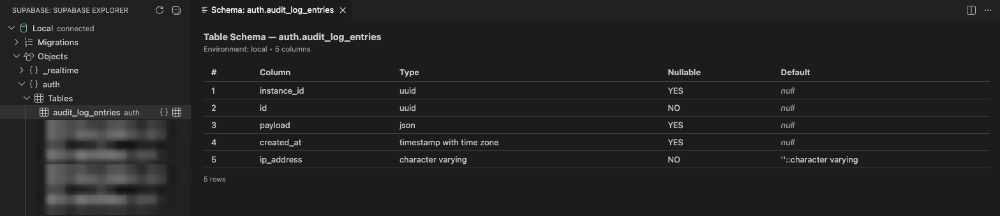
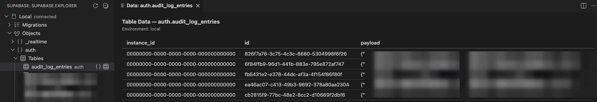
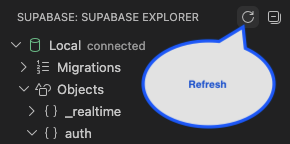

# XTECH Supabase Extension Details

XTECH Supabase is a Visual Studio Code extension for inspecting and working with local and linked Supabase environments without leaving the editor.

## Requirements

- VS Code 1.85.0 or later
- Supabase CLI installed and available on your PATH
- A workspace with a Supabase project (must contain supabase/config.toml)

## Installation

### Install from the VS Code Marketplace

1. Open VS Code.
2. Open Extensions (Cmd+Shift+X on macOS).
3. Search for XTECH Supabase.
4. Select Install.

### Install from VSIX

1. Build/package the extension.
2. Install the VSIX:

```bash
code --install-extension xtech-supabase-0.0.1.vsix
```

## Activation and Startup

The extension activates when your workspace contains supabase/config.toml.

On activation it:

- Discovers the Supabase project root
- Resolves local and linked environments
- Loads tree data into the Supabase Explorer activity bar view

If no Supabase project is discovered, the tree remains empty until a valid project folder is opened.

## Configuration

All settings are under Extensions > XTECH Supabase.

| Setting                         | Type         | Default | Purpose                                       |
| ------------------------------- | ------------ | ------- | --------------------------------------------- |
| xtech-supabase.projectPath      | string       | none    | Override auto-detected Supabase project path  |
| xtech-supabase.authMode         | cli or token | cli     | Select authentication source                  |
| xtech-supabase.refreshInterval  | number       | 0       | Auto-refresh in seconds (0 disables)          |
| xtech-supabase.localDbUrl       | string       | none    | Override local Postgres URL                   |
| xtech-supabase.linkedProjectRef | string       | none    | Override linked project reference             |
| xtech-supabase.useDataWrangler  | boolean      | false   | Use Data Wrangler for table/view data display |

## Authentication

### CLI Mode (default)

1. Sign in via Supabase CLI:

```bash
supabase login
```

2. Link your workspace project (if needed):

```bash
supabase link --project-ref <project-ref>
```

The extension will use the existing CLI session.

### Token Mode

1. Create a personal access token in Supabase account settings.
2. Set xtech-supabase.authMode to token.
3. Run command: XTECH Supabase: Set Supabase Access Token.
4. Paste token when prompted.

To remove token, run: XTECH Supabase: Clear Supabase Access Token.

## Usage Guide

### Screenshots

### Explorer and Setup



_Supabase Explorer with Local and Linked environments visible._



_Token-based authentication setup flow from the command palette._

### Migration and Object Workflows



_Migration listing and create migration workflow in VS Code._



_Table schema viewer with column metadata._



_Data viewer showing row preview for a selected table._



_Refresh action in the explorer title bar._

### Open the Explorer

1. Click the Supabase activity bar icon.
2. Expand Local or Linked.
3. Expand a category (Migrations, Objects, Functions, Triggers, Enums, Indexes, Roles, Policies, Storage).

### Migration Workflow

1. Expand Local > Migrations.
2. Review status indicators (pending/local/linked/both).
3. Run command: XTECH Supabase: Create New Migration.
4. Enter migration name (letters, numbers, underscores).
5. The migration file is created and opened.

### Object Browsing and Viewers

For supported objects, inline actions in the tree open rich viewers:

- Tables: schema + data
- Views: schema + data
- Functions: function details and definition
- Triggers: trigger details
- Indexes: index definition
- Policies: policy details
- Roles: role attributes
- Storage Buckets: bucket metadata

### Refresh Behavior

Use either:

- Explorer toolbar refresh button
- Command: XTECH Supabase: Refresh Supabase Explorer
- Auto-refresh via xtech-supabase.refreshInterval

## Troubleshooting

### Linked tree appears but no linked object data

Set a valid Supabase personal access token and verify auth mode.

### Local objects are empty

Start local Supabase services:

```bash
supabase start
```

### Extension view is empty

Confirm your workspace includes supabase/config.toml.

## Command Reference

- XTECH Supabase: Refresh Supabase Explorer
- XTECH Supabase: Create New Migration
- XTECH Supabase: Set Supabase Access Token
- XTECH Supabase: Clear Supabase Access Token
- XTECH Supabase: View Table Schema
- XTECH Supabase: View Table Data
- XTECH Supabase: View View Schema
- XTECH Supabase: View View Data
- XTECH Supabase: View Function Details
- XTECH Supabase: View Trigger Details
- XTECH Supabase: View Index Details
- XTECH Supabase: View Policy Details
- XTECH Supabase: View Role Details
- XTECH Supabase: View Storage Bucket Details
