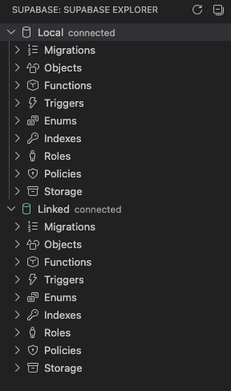
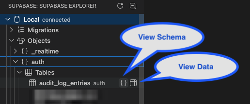
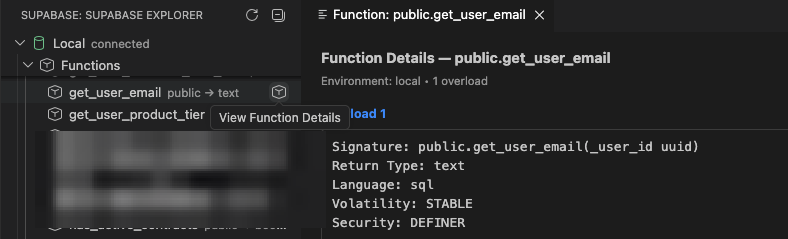
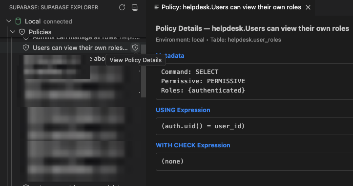
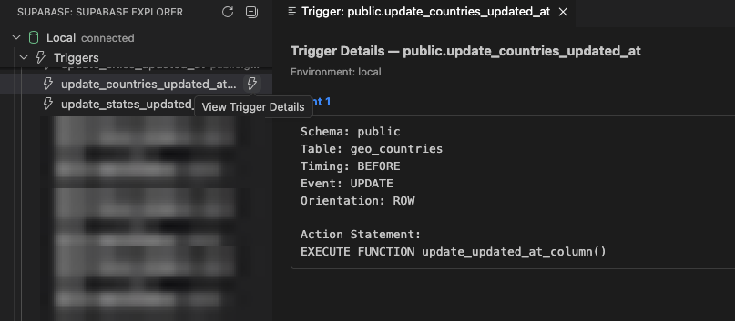
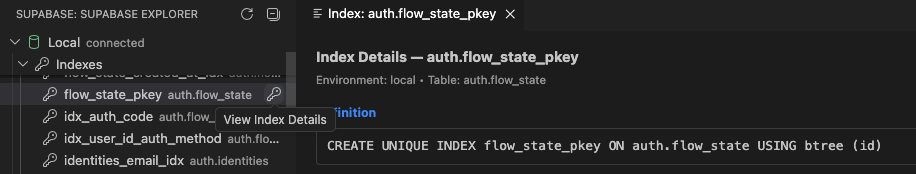
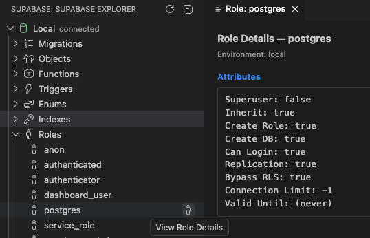
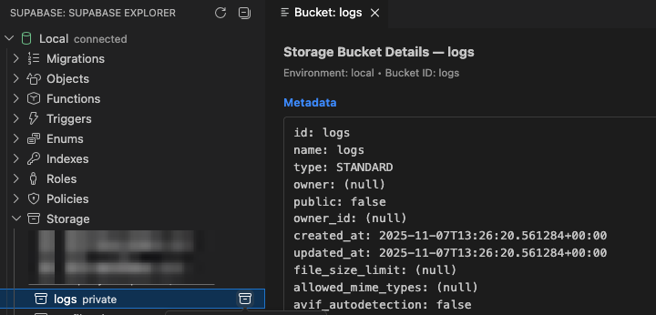

# XTECH Supabase Features

This page describes extension capabilities by feature area, including how each one is used in day-to-day development.

## Supabase Explorer (Activity Bar)

The Supabase Explorer provides a unified tree for Local and Linked environments.

### What it provides

- Separate Local and Linked roots
- Fast hierarchical browsing by object category
- Inline actions for viewer-enabled objects

### Typical use

1. Open Supabase activity bar view.
2. Expand Local and Linked side by side.
3. Compare object availability and metadata between environments.

## Migration Management

### Capabilities

- Discover and list migration files
- Show migration status across local and linked
- Create timestamped migrations directly from VS Code

### Typical use

1. Open Local > Migrations.
2. Check status indicator for each migration.
3. Create a new migration from command palette.

## Database Object Introspection

The extension introspects and lists:

- Schemas
- Tables
- Views
- Functions
- Triggers
- Enums
- Indexes
- Roles
- Policies
- Storage buckets

## Object Viewers

### Screenshots

_Supabase Explorer overview with major object categories._

_Inline actions for schema, data, and details viewers._

_Function details including signature, volatility, and SQL definition._

_RLS policy details including USING and WITH CHECK expressions._

_Trigger details including timing, event, and action statement._

_Index definition viewer from pg_indexes metadata._

_Role attributes and privileges in the role details viewer._

_Storage bucket metadata details in viewer panel._

### Tables and Views

- View schema (columns, types, nullability, defaults)
- View sample data (row preview)

### Functions

- View overload signatures
- View language, volatility, security mode
- View full function definition SQL

### Triggers

- View trigger timing/event
- View orientation and action statement

### Indexes

- View full index definition SQL

### Policies

- View command scope, permissive mode, roles
- View USING and WITH CHECK expressions

### Roles

- View role attributes (login, privileges, limits)

### Storage Buckets

- View bucket metadata details

## Authentication Modes

### CLI Session Mode

Uses existing Supabase CLI session and link context.

### Token Mode

Uses secure token storage in VS Code SecretStorage for linked queries.

## Refresh and Data Reload

You can reload explorer content by:

- Clicking refresh icon in the view title
- Running refresh command from command palette
- Enabling automatic refresh interval

## Feature Matrix

| Feature                       | Local | Linked |
| ----------------------------- | ----- | ------ |
| Migrations listing/status     | Yes   | Yes    |
| Migration creation            | Yes   | N/A    |
| Object listing                | Yes   | Yes    |
| Table/View schema viewer      | Yes   | Yes    |
| Table/View data viewer        | Yes   | Yes    |
| Function details viewer       | Yes   | Yes    |
| Trigger details viewer        | Yes   | Yes    |
| Index details viewer          | Yes   | Yes    |
| Policy details viewer         | Yes   | Yes    |
| Role details viewer           | Yes   | Yes    |
| Storage bucket details viewer | Yes   | Yes    |

## Current Scope and Planned Work

### Included now

- Explorer tree and object introspection
- Migration visibility and creation
- Viewer actions for key object types

### Planned enhancements

- Storage viewer raw JSON toggle
- Role viewer SQL copy helper
- Phase 2 CLI execution workflows
